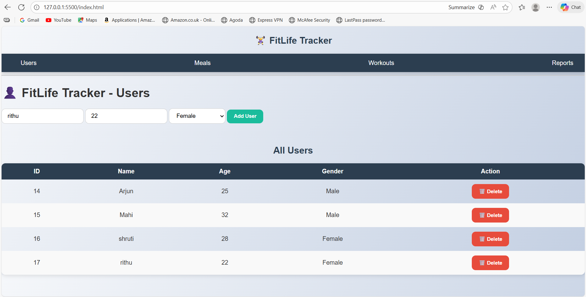

# 🏋️‍♀️ FitLife Tracker
A complete fitness tracking web application built using **Spring Boot, Java, HTML, CSS, and JavaScript**.  
This project allows users to track **meals, workouts, calories consumed, calories burned, and view daily reports**.

---

## 🚀 Features

### 👤 User Management
- Add new users  
- View all users  
- Delete users  

### 🍽 Meals Tracking
- Add meals with meal type, calories, date  
- View meals by user  
- Delete meals  

### 🏃‍♂️ Workouts Tracking
- Add workouts with duration, type, calories burned  
- View workouts by user  
- Delete workouts  

### 📊 Reports
- Total calories consumed  
- Total calories burned  
- Net calorie balance  
- Clean UI card-style report  

---

## 🏗 Tech Stack

### **Backend**
- Spring Boot  
- Java  
- JPA / Hibernate  
- MySQL Database  
- REST APIs  

### **Frontend**
- HTML  
- CSS  
- JavaScript (Fetch API)
- Responsive UI Cards & Tables  

---

## 📁 Project Structure

```
FitLifeTracker/
│
├── Backend/                # Spring Boot project
│   ├── src/main/java/…     # Controllers, Services, Entities
│   ├── src/main/resources/ # application.properties
│   └── pom.xml
│
└── Frontend/               # HTML, CSS, JS files
    ├── index.html
    ├── meals.html
    ├── workouts.html
    ├── reports.html
    ├── css/
    └── js/
```

---

## 🧪 How to Run the Project

### 🔹 Backend (Spring Boot)
1. Open project in Eclipse/IntelliJ  
2. Configure MySQL in `application.properties`  
3. Run:  
```
mvn spring-boot:run
```

### 🔹 Frontend
Simply open any HTML file like:
```
Frontend/index.html
```

---

## 📸 Screenshots

### 🧑‍💼 Users Page


### 🍽️ Meals Page


### 🏋️‍♂️ Workouts Page


### 📊 Reports Page


---

## 🎯 Purpose of the Project
This project was created to demonstrate:
- Java & Spring Boot backend skills  
- API development  
- Database handling with JPA  
- Frontend integration using HTML/CSS/JS  
- Full-stack project building  

---

## 📬 Contact
**Developer:** Kavya Yarabothu  
**LinkedIn:** https://www.linkedin.com/in/kavya-yarabothu 

---

# 🌟 If you like this project, feel free to ⭐ the repository!

